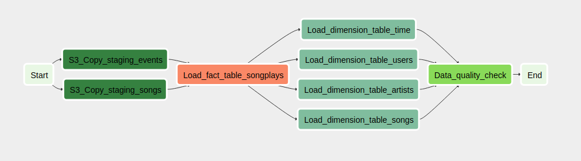

# UDE-airflow

In previous repositories we have presented ilustrated real life scenarios in the context of the Data Engineering. We have explored the normalization and denormalization of data-sets and how these models fit in [SQL (PostgreSQL)](https://github.com/juferafo/UDE-postgres) and [no-SQL (Casandra)](https://github.com/juferafo/UDE-cassandra) models, the underlying structure of [Data Warehouses (Redshift)](https://github.com/juferafo/UDE-redshift) (DWH) and [Data Lakes (S3)](https://github.com/juferafo/UDE-data-lake) (DL) and why it is useful to make use of cloud providers to host these resources. 

Following the line of these repositories we present here the use case where our company (Sparkify) needs to feed the Data Warehouse hosted in [Redshift](https://aws.amazon.com/redshift/?whats-new-cards.sort-by=item.additionalFields.postDateTime&whats-new-cards.sort-order=desc) with fresh data in a regular basis. 

To acompish this task we will employ [Apache Airflow](https://airflow.apache.org/). Apache Airflow is an open-source orquestration tool that is widely used to configure and trigger data pipelines both on a regular basis and on demand. In our case, the pipeline will read fresh data from the staging area located in Amazon S3, perform transformations on it if needed, and insert the data in Redshift where the information is organized as a [star-shaped schema](https://www.guru99.com/star-snowflake-data-warehousing.html). 

## Project datasets

We are going to process data related to the customer's usage of a music app. This information is organized in two datasets: the song and the log dataset as they encapsulate different particularities.

### Song dataset

The song dataset is a subset of the [Million Song Dataset](http://millionsongdataset.com/) and it contains information about the songs available in the music app. The records are categorized, among other fields, by artist ID, song ID, title, duration, etc... Each row is written as a JSON file with the following schema and file structure.

```
/PATH/TO/song_data/
└── A
    ├── A
    │   ├── A
    │   ├── B
    │   └── C
    └── B
        ├── A
        ├── B
        └── C
```

Example of a song data file.

```
{
    "num_songs": 1, 
    "artist_id": "ARJIE2Y1187B994AB7", 
    "artist_latitude": null,
    "artist_longitude": null,
    "artist_location": "",
    "artist_name": "Line Renaud",
    "song_id": "SOUPIRU12A6D4FA1E1",
    "title": "Der Kleine Dompfaff",
    "duration": 152.92036,
    "year": 0
}
```

### Log dataset

The log dataset contains information about the user interaction with the app (sign-in/out, user ID, registration type, listened songs, etc...). This dataset was built from the events simulator [eventsim](https://github.com/Interana/eventsim) and, like the song dataset, the information is stored in JSON files. Below you can find the schema of the log dataset.

```
{
  artist TEXT,
  auth TEXT,
  firstName TEXT,
  gender TEXT,
  itemInSession INT,
  lastName TEXT,
  length DOUBLE,
  level TEXT,
  location TEXT,
  method TEXT,
  page TEXT,
  registration DOUBLE,
  sessionId INT,
  song TEXT,
  status INT,
  ts FLOAT,
  userId INT
}
```

The above datasets are placed in the S3 buckets shown below.

* Song data bucket: `s3://udacity-dend/song_data`
* Log data bucket: `s3://udacity-dend/log_data`

## Redshift structure

As mentioned in the descriptions, redshift will be the end place of the log and song data. This information will be re-shaped in the form of a star-schema where `songplays` will be the fact table that encapsulates the songs played by the customers and `artist`, `song`, `time` and `user` provide additional details to certain particularities of the data in the fact table. Below one can find the schema of each of these tables.


##### `songplays` fact table

```
songplay_id INT,
start_time TIMESTAMP, 
user_id INT, 
level VARCHAR, 
song_id VARCHAR, 
artist_id VARCHAR, 
session_id INT, 
location VARCHAR, 
user_agent VARCHAR
```

##### `artist` dimension table

```
artist_id VARCHAR,
artist_name VARCHAR,
artist_location VARCHAR,
artist_latitude INT,
artist_longitude INT
```

#### `song` dimension table

```
song_id VARCHAR,
title VARCHAR,
artist_id VARCHAR,
year INT,
duration FLOAT
```

##### `time` dimension table

```
start_time TIMESTAMP,
hour INT,
day INT,
week INT,
month INT,
year INT,
weekday INT
```

##### `user` dimension table

```
user_id INT,
first_name VARCHAR,
last_name VARCHAR,
gender VARCHAR,
level VARCHAR
```

## Data pipeline

As mentioned in the introduction, Apache Airflow is an orchestration tool employed to trigger ETL pipelines at a given schedule. These pipelines group together a set of tasks like, for example, execute a query against a database. The DAGs must be designed without loops and, because of this, they are known as Diagramatic Acyclic Graphs or DAGs. The pipelines are written in Python code and each task is instanciated as an [Airflow Operator](https://airflow.apache.org/docs/apache-airflow/stable/howto/operator/index.html). Despite existing a wide range of operators already included in the [Airflow library](https://airflow.apache.org/docs/apache-airflow/stable/_api/airflow/operators/index.html) it is possible to code a customized one or to add new features to an already existing operator to suits the user's needs.

### DAG pipeline

The DAG can be found in the script `./dags/sparkify_dag.py` and, although it is executed from `Start` to `End` one can find the following division in the pipeline:

1. The set of tasks that copy the raw `events` and `songs` data into the Redshift Staging Area


2. The set of tasks that read the `events` and `songs` in the Redshift Staging Area and put this information into a star-schema.


Below you can find the DAG pipeline from `Start` to `End`.



#### Custom operators

To simplify and make the DAG code easier to read four [custom operators](https://airflow.apache.org/docs/apache-airflow/stable/howto/custom-operator.html) were designed:

1. `StageToRedshiftOperator`: This operator was coded to copy data from S3 into Redshift. In the pipeline ilustrated above it is used in the steps `S3_Copy_staging_events` and `S3_Copy_staging_songs`.

2. `LoadFactOperator`: This operator is used to load data into the fact table `songplays`.

3. `LoadDimensionOperator`: This operator is used to load data into the dimension tables `artists`, `songs`, `time` and `users`.

4. `DataQualityOperator`: This operator is used to check the quality of the data loaded into Redshift.

The code of these operators and additional helper classes can be found in `./plugins/operators` and `./plugins/helpers/sql_queries.py`.

### Apache Airflow configuration

The data pipeline needs to access certain services from AWS like S3 or Redshift. For this purpose it is necessary to set-up two [connections](https://airflow.apache.org/docs/apache-airflow/stable/howto/connection.html) with the following IDs:

1. `aws_credentials`: this connection must be configured as `Amazon Web Services` and it will contain the AWS credentials. This is required, for example, to read data from S3. 

2. `redshift_conn_id`: this connection must be configured as `Postgres` and it will encapsulate the endpoint, schema, login and password to access the Redshift cluster.

## Requirements

1. [Apache Airflow](https://airflow.apache.org/)
2. [Python 3](https://www.python.org/)
